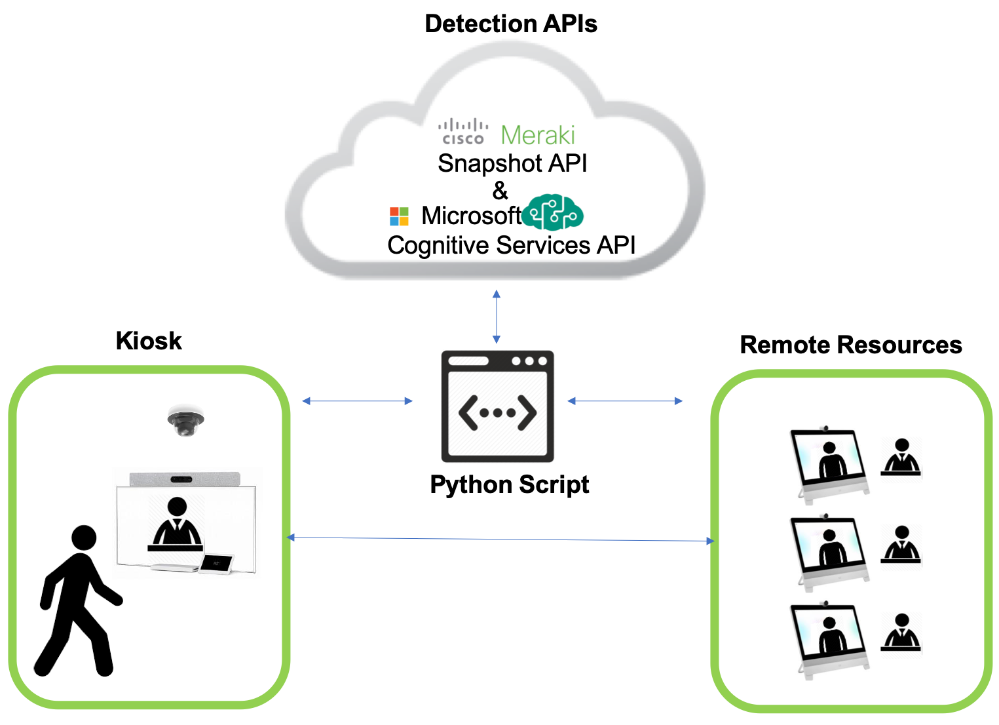

# Connected-Service

Intelligently initate video calls based on a person's presense.


## Business/Technical Challenge

Many would agree there is nothing quite like a face to face conversation. Unfortunately, the world we live in today - one of agile changes and multidisciplinary teams - requires a proxy to human to human interaction effective enough to exchange thoughts, but quick enough to make adjustments at a moment's notice.  Video has proven to be an adept tool at connecting specialized teams to broader audiences, but many of the general public are to this day still coming to terms with leveraging video for frequent communications. Learning how to operate video endpoints may come with an unpredictably small or large learning curve, depending that individual's familiarity with video conferencing. This learning curve can introduce "friction" to one's willingness to interact with technology, often providing discouragement to the user and sometimes ending in total disengagement.


Despite aesthetic improvements to the user interface - making the video platform more "user friendly", the broader idea of improving how people interact with technology becomes a problem with many potential solutions.

## Proposed Solution

Cisco has already created an amazing platform for video communications that resembles a true face to face conversation. While we have made great efforts to simply our user interface there still exist many people that hesitate to approach new technology. 

Our proposed solution leverages Meraki MV Camera's Sense API to detect when a person approaches a video endpoint and auto initiates a call to a remote destination. Thus, from a user’s perspective they simply have to walk up to a screen to be connected with a remote resource.


## Cisco Products Technologies/ Services

Our solution leverages the following Cisco technologies:

*  [WebEx Room Series](https://www.cisco.com/c/en/us/products/collaboration-endpoints/webex-room-series/index.html)
	*  [Cisco Video Endpoint XAPI](https://www.cisco.com/c/dam/en/us/td/docs/telepresence/endpoint/)
* [Cisco Unified Communications Manager (CUCM)](https://www.cisco.com/c/en_ca/products/unified-communications/unified-communications-manager-callmanager/index.html)
*  [Meraki MV Camera](https://meraki.cisco.com/products/security-cameras)
	*  [Meraki MV Sense API](https://developer.cisco.com/meraki/mv-sense/)

In addition our solution also leverages
*  [MQTT](https://developer.cisco.com/meraki/mv-sense/#!mqtt)
	* [Meraki MV MQTT parser](https://github.com/shiyuechengineer/adventure-lab)
*  [Microsoft Cognitive Services API](https://azure.microsoft.com/en-ca/services/cognitive-services/)


## Team Members

* Samantha Yiu <sayiu@cisco.com> - Ontario Central Territories Account
* Erik Lefebvre <eriklef@cisco.com> - British Columbia Territories Account


## Solution Components



There are two main modules in the solution. They are described below:

### Person/People detection - mqtt_detect_people.py
The mqtt_detect_people.py script is responsible for detecting if a person walks into frame and initiating a new call if the video endpoint is not already on a call.

The MQTT script performs the following functions:
1. Starts the MQTT client on loop
2. Subscribes to MQTT Topic for the Meraki camera's zone
3. Parses the returned json for people
4. If people are found, it checks if the video endpoint is already on a call
5. If not already on a call, initializes the calling script

### Calling - image_recog_calling.py
The image_recog_calling.py script grabs a snapshot of the current camera feed and submits it to Microsoft Cognitive Services to perform a double-blind check and ensure the MV people detection flag is not a false positive. If there is indeed a person, it initiates a call to the predefined hunt group.

The Calling script performs the following functions:
1. Grab snapshot from MV camera
2. Submit snapshot to Microsoft Cognitive Services 
3. Analyze json response
4. If a person is confirmed present, initates call to hunt predefined huntgroup


### Overall Flow

## Prerequisite
Besides having the code installed correctly and the credentials file updated, end users will need to supply their own hardware and preconfigured CUCM. End users will also need to request free access keys for Microsoft Cognitive Services Face API from here: https://azure.microsoft.com/en-ca/try/cognitive-services/my-apis/?api=face-api.

## Setup/Installation

0. Install [Python 3+](https://www.python.org/downloads/)
1. Install Mosquitto 
```
pip install paho-mqtt
```
2. Clone this repository
```
git clone https://github.com/eriklef/Connected-Service.git
```
3. Update credentials.ini file with relevant information
4. [Point Meraki MV camera to MQTT Broker](https://developer.cisco.com/meraki/mv-sense/#!mqtt/configuring-mqtt-in-the-dashboard)
4. Start the script
```
python3 mqtt_detect_people.py
```


## License

Provided under Cisco Sample Code License, for details see [LICENSE](./LICENSE.md)

## Code of Conduct

Our code of conduct is available [here](./CODE_OF_CONDUCT.md)

## Contributing

See our contributing guidelines [here](./CONTRIBUTING.md)

## Video

See our video explaining Connected Service [here](https://www.youtube.com/watch?v=UZ_nbT0ww0I)
